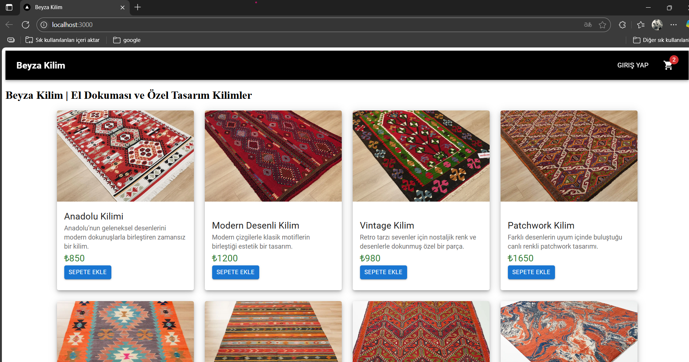
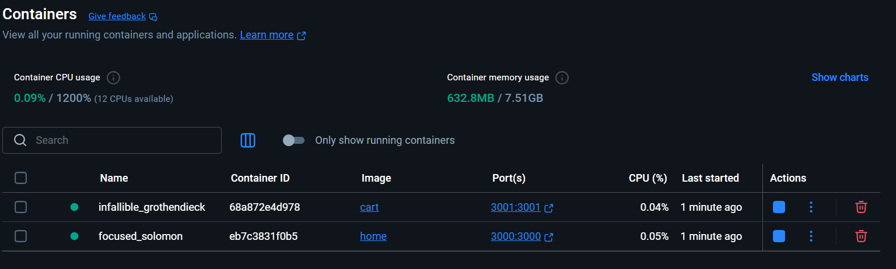
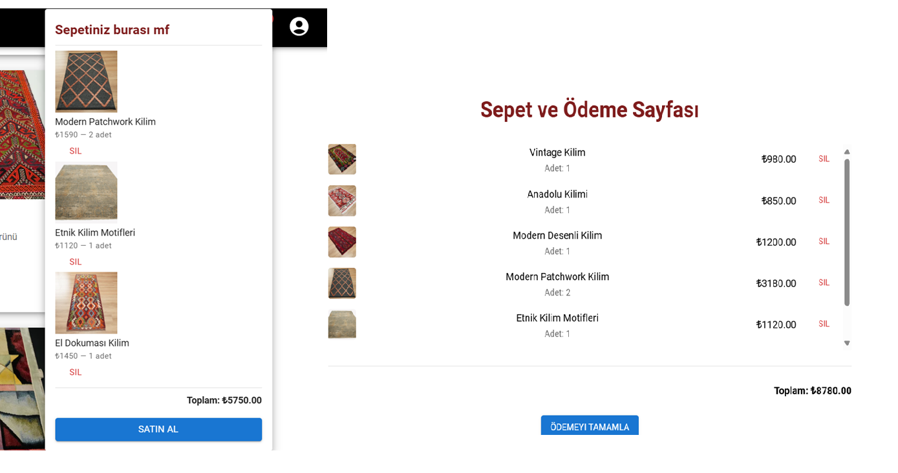

# 🧵 Beyza Kilim | Mikro-Frontend Mimarili E-Ticaret Uygulaması

Bu proje, **mikro-frontend mimarisi** kullanılarak geliştirilmiş, el dokuması ve özel tasarım kilimlerin listelendiği ve sepete eklenebildiği modern bir e-ticaret platformudur. Proje, iki bağımsız React tabanlı uygulamadan oluşmaktadır: `home` (ürün listeleme) ve `cart` (sepet görüntüleme). Uygulamalar, Webpack Module Federation ile entegre edilerek tek bir birleşik kullanıcı deneyimi sunmaktadır.


# Proje kaynağı:
🔗 [Link](https://github.com/beyza-acikgoz/task-frontend)

## 🧩 Mikro-Frontend Mimarisi

Uygulama iki ayrı Docker servisi olarak yapılandırılmıştır:

- **home**: Ana uygulama; ürün listesi, ürün kartları ve "Sepete Ekle" işlevselliğini içerir.
- **cart**: Mikro-frontend olarak yapılandırılmış sepet uygulamasıdır; sepete eklenen ürünleri gösterir.

Her biri bağımsız build sürecine sahiptir ve farklı portlarda çalışır:

| Uygulama | Port | Açıklama |
|----------|------|----------|
| `home`   | 3000 | Ana uygulama |
| `cart`   | 3001 | Sepet mikro-frontendi |

> **Not:** `home` uygulaması bağımsız çalışabilir. Ancak kullanıcı "Sepet" bölümüne girmek istediğinde `cart` mikro-frontendi çağrılır. Eğer `cart` çalışmıyorsa, `home` uygulaması kesintisiz devam eder. Bu dayanıklılık yapısı, `safeLazy` fonksiyonu ile sağlanmıştır.

---

## 🖼️ Proje Görselleri

### Ana Sayfa


### Docker Container Yapısı


### Sepet Görünümleri


---

## 🚀 Kurulum ve Çalıştırma

### Gereksinimler

- Node.js `>=18`
- Docker & Docker Compose
- Git

### 1. Manuel Kurulum

Projeyi yerel ortamda çalıştırmak için aşağıdaki adımları takip edebilirsiniz:

```bash
git clone https://github.com/beyza-acikgoz/task-frontend.git
cd task-frontend
```

Her iki uygulama için ayrı ayrı terminal açarak aşağıdaki işlemleri uygulayın:

#### `home` için:
```bash
cd home
npm install
npm start
```

#### `cart` için:
```bash
cd cart
npm install
npm start
```

- `home` uygulaması varsayılan olarak `http://localhost:3000` adresinde çalışır.
- `cart` uygulaması ise `http://localhost:3001` adresinde çalışır.

---

### 2. Docker ile Kurulum

Docker ortamında projenin ayağa kalkması için aşağıdaki komutları çalıştırmanız yeterlidir:

```bash
git clone https://github.com/beyza-acikgoz/task-frontend.git
cd task-frontend
docker-compose up --build
```

- `home` servisi `http://localhost:3000`
- `cart` servisi `http://localhost:3001` adresinden erişilebilir.

> Not: Başka Docker container'lar aynı portları kullanıyorsa çakışma olabilir. Öncesinde çalışan container’ları durdurmak için:
```bash
docker ps  # çalışan container'ları gösterir
docker stop <container_id>  # durdurmak için
```

`.env` dosyaları isteğe bağlıdır, eksikse varsayılan ayarlarla devam eder.

---

## 🛠️ Kullanılan Teknolojiler

| Teknoloji | Açıklama |
|----------|----------|
| **Tailwind CSS** | Hızlı ve esnek tasarım için |
| **Webpack Module Federation** | Mikro-frontend yapısı için modül paylaşımı |
| **Docker** | Container bazlı yapılandırma |
| **safeLazy** | Hatalı mikro-frontend modüllerinde ana uygulamanın çalışmaya devam etmesi için fallback fonksiyonu |

---

## 📦 Proje Yapısı

```
/beyza-kilim-microfrontend
│
├── /home               # Ürün listeleme ve UI
├── /cart               # Sepet uygulaması
```

---

## 💡 safeLazy Fonksiyonu

```ts
export function safeLazy( factory: () => Promise<{ default: React.ComponentType<any> }>,
 onError?: (error: Error) => void) {
  return React.lazy(() =>factory().catch((error) => {console.error("Failed to load remote module", error);
      if (onError) onError(error);
      return { default: () => <div>MF yapısı şu anda kullanılamıyor. Bağlı projeleri çalıştırın!!</div> };}));}
```

Bu fonksiyon sayesinde `cart` uygulaması hatalı veya kapalı olduğunda `home` uygulaması çalışmaya devam eder, kullanıcıya bilgi verilir.

---


## 👩‍💻 Geliştirici

**Beyza Açıkgöz**  
Frontend Developer  
📍 İstanbul / Kayseri  
🔗 [GitHub](https://github.com/beyza-acikgoz)
🔗 [Linkedin](https://www.linkedin.com/in/beyzaacikgoz/)

---

## 🧵 Sonuç

Bu proje, frontend geliştiriciler için **mikro-frontend mimarisi**, **modern UI tasarımı**, **veri senkronizasyonu** ve **dayanıklı yapı** konularında yetkinlik sergileyen başarılı bir örnektir. Her mikro uygulama, bağımsız geliştirme ve deploy imkanı sağlar.
